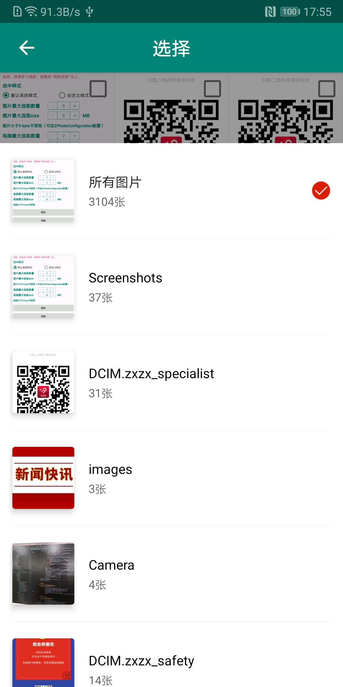

[](https://github.com/zippo88888888/ZPhoto)
[](https://github.com/zippo88888888/ZPhoto)
[](https://www.apache.org/licenses/LICENSE-2.0)


有很多优秀的图片选择框架，但是大部分集成了许多第三方框架，对我来说不简洁！貌似还没看到用KT写的（Kotlin是这世上最好的语言）果断撸一个...<br><br>
**↓↓↓站在巨人的肩部上，你绝对能看得更远 鸣谢↓↓↓**<br>
[RxGalleryFinal](https://github.com/FinalTeam/RxGalleryFinal)&nbsp;&nbsp;&nbsp;&nbsp;
[android-crop](https://github.com/jdamcd/android-crop)&nbsp;&nbsp;&nbsp;&nbsp;
[JiaoZiVideoPlayer](https://github.com/lipangit/JiaoZiVideoPlayer)


# 本库特点

##### 1. **基于android-crop修改后的图片剪裁外无其他第三方库[gradle配置](https://github.com/zippo88888888/ZPhoto/blob/master/zphoto_lib/build.gradle)**；
##### 2. 支持视频、图片、GIF查看，图片裁剪，压缩；
##### 3. 支持图片、视频 --->>> { 单选、多选 } && { 数量、大小限制 }；
##### 4. 支持样式自定义；
##### 5. 适配AndroidX AndroidQ && Kotlin编码，100%兼容Java；


### 截图
<div align="center">



</div>

# 使用（[Java调用](https://github.com/zippo88888888/ZPhoto/blob/master/app/src/main/java/com/zp/zphoto/sample/sample/java_sample/JavaMainActivity.java)）

#### Step 0. 添加依赖（非AndroidX版本已停止更新，请尽快切换至AndroidX 版本）

gradle
```
// Android X 版本
implementation 'com.github.zp:zphoto_lib:1.5.1'

// 非Android X 版本
implementation 'com.github.zp:zphoto_lib:1.4.4' 


// 如果报错，加上
android {
    ...
    
    // Kotlin Parcelable 支持
    androidExtensions {
       experimental = true
    }
}


```

maven
```xml
<dependency>
	<groupId>com.github.zp</groupId>
	<artifactId>zphoto_lib</artifactId>
	<version>1.5.1</version>
	<type>pom</type>
</dependency>
```

或 aar --> [AndroidX版本](https://github.com/zippo88888888/ZPhoto/blob/master/app/src/main/assets/zphoto_lib_1.5.1.aar) 
&nbsp;&nbsp;[非AndroidX版本](https://github.com/zippo88888888/ZPhoto/blob/master/app/src/main/assets/zphoto_lib_1.4.4.aar)


**↓↓↓不要忘记权限↓↓↓**
```xml
<uses-permission android:name="android.permission.READ_EXTERNAL_STORAGE" />
<uses-permission android:name="android.permission.WRITE_EXTERNAL_STORAGE" />
<uses-permission android:name="android.permission.CAMERA" />
```

#### Step 1.  新建图片加载，继承自ZImageLoaderListener，实现自己的图片加载方式
```kotlin
class MyImageLoaderListener : ZImageLoaderListener {

    override fun loadImg(imageView: ImageView, file: File) {
        ImageLoad.loadImage(file, imageView)
    }

    // Android Q会调用此方法
    override fun loadImg(imageView: ImageView, uri: Uri?, file: File) {
        if (uri == null) {
            loadImg(imageView, file)
        } else {
            ImageLoad.loadImage(uri, imageView)
        }
    }

    override fun loadImg(imageView: ImageView, path: String) {
        ImageLoad.loadImage(path, imageView)
    }

    override fun loadImg(imageView: ImageView, res: Int) {
        ImageLoad.loadImage(res, imageView)
    }

    
}
```
#### Step 2. 在Application中或Activity中初始化
```kotlin
ZPhotoHelp.getInstance().init(this, MyImageLoaderListener())
```
#### Step 3. Activity or Fragment 配置 实现 ZImageResultListener 接口，用于数据接收
```kotlin

  // 图片选择成功
  override fun selectSuccess(list: ArrayList<ZPhotoDetail>?) {
        Log.e(TAG, "选中的数量：${list?.size}")
    }

   // 图片选择失败
    override fun selectFailure() {
        Log.e(TAG, "不能够获取图片信息")
    }
    
    // 用户取消
    override fun selectCancel() {
        Toast.makeText(this, "用户取消", Toast.LENGTH_SHORT).show()
    }

  // 权限处理
  override fun onRequestPermissionsResult(requestCode: Int, permissions: Array<out String>, grantResults: IntArray) {
        super.onRequestPermissionsResult(requestCode, permissions, grantResults)
        ZPhotoHelp.getInstance().onRequestPermissionsResult(requestCode, permissions, grantResults, this)
    }
    // 相机拍照处理
    override fun onActivityResult(requestCode: Int, resultCode: Int, data: Intent?) {
        super.onActivityResult(requestCode, resultCode, data)
        ZPhotoHelp.getInstance().onActivityResult(requestCode, resultCode, data, this)
    }


```
#### Step 4. 配置 [FileProvider](https://developer.android.com/reference/android/support/v4/content/FileProvider)
```xml

<!-- 新建paths文件，如果已有，修改即可  -->
   <paths>
      <external-path
        name="z_photo_path"
        path="." />

  </paths>
    

    <!-- 在AndroidMainfest  -->
     <provider
            android:name="androidx.core.content.FileProvider"
            android:authorities="${applicationId}.FileProvider"
            android:exported="false"
            android:grantUriPermissions="true">
            <meta-data
                android:name="android.support.FILE_PROVIDER_PATHS"
                android:resource="@xml/your xml" />
        </provider>  
        
```
```kotlin

    // 配置ZPhotoConfiguration，里面包含了是否显示gif，视频等属性
    private fun getConfig() = ZPhotoConfiguration().apply {
        ... 
        // 具体请以自己的 authorities 为准
        authority = "your package name.FileProvider"
    }
    
```
#### Step 5. 使用
```kotlin
      // 去相册
      main_photoBtn.setOnClickListener {
            ZPhotoHelp.getInstance()
                .setZImageResultListener(this)
                .config(getConfig()) // 配置信息 具体请查看 ZPhotoConfiguration
                .toPhoto(this)
        }
        // 去相机
        main_cameraBtn.setOnClickListener {
            ZPhotoHelp.getInstance()
                .setZImageResultListener(this)
                .config(getConfig()) // 配置信息 
                .toCamera(this)
        }
        
```
#### Step 6. 释放资源
```kotlin
    
    // 及时释放
    override fun onDestroy() {
        super.onDestroy()
        ZPhotoHelp.getInstance().reset()
    }

```

**由于本库没有引用其他压缩库，但是已经将方法暴露出去了，所以压缩需要自己实现**

## 图片压缩
#### 1. 新建图片压缩，继承自ZImageCompress，实现压缩方法（以Luban为例）
```kotlin
 class MyImageCompress : ZImageCompress() {

    override fun onPreExecute() {
        super.onPreExecute()
        Log.i("ZPhotoLib", "onPreExecute")
    }

    /**
     * 这里仅供参考，具体以自己的业务逻辑为主
     */
    override fun doingCompressImage(arrayList: ArrayList<ZPhotoDetail>?): ArrayList<ZPhotoDetail>? {
        if (arrayList == null || getContext() == null) {
            return ArrayList()
        }

        // 输出路径  Android Q ---> 这里是沙盒里面的，如果要放在外部，需要将沙盒里面的 复制 到 外部路径
        val outDir = ZPhotoUtil.getCompressPath()

        val builder = Luban.with(getContext())

        if (Build.VERSION.SDK_INT >= Build.VERSION_CODES.Q) { // Android Q 先复制到沙盒目录在进行操作
            val list = ArrayList<File>()
            arrayList.forEach {
                val newFile = File(outDir + it.name)
                val isSuccess = copyFile(getContext(), it.uri!!, newFile)
                if (isSuccess) {
                    Log.i("ZPhotoLib", "图片复制到沙盒目录成功")
                    list.add(newFile)
                } else {
                    list.add(File(it.path))
                }
            }
            builder.load(list)
        } else {
            val list = ArrayList<File>()
            arrayList.forEach { list.add(File(it.path)) }
            builder.load(list)
        }

        val compactList = builder
            .ignoreBy(50)       // 小于50K不压缩
            .setTargetDir(outDir)    // 压缩后图片的路径
            .filter {
                // 设置压缩条件 gif、视频 不压缩
                !(TextUtils.isEmpty(it) ||
                        it.toLowerCase().endsWith(".$GIF") ||
                        it.toLowerCase().endsWith(".$MP4"))
            }.get()

        arrayList.indices.forEach {
            val path = compactList[it].path
            val size = ZPhotoUtil.getDefaultFileSize(path)
            Log.e("ZPhotoLib", "原图大小：${arrayList[it].size}M <<<===>>>Luban处理后的大小：${size}M")
            arrayList[it].path = path
            arrayList[it].parentPath = ""
            arrayList[it].size = size
            arrayList[it].isGif = checkGif(path)
        }
        return arrayList
    }

    override fun onPostExecute(list: ArrayList<ZPhotoDetail>?) {
        super.onPostExecute(list)
        Log.i("ZPhotoLib", "onPostExecute")
    }

    /**
     * 将SD卡上的文件复制到沙盒目录
     * @param uri           原文件
     * @param targetFile    沙盒目录的文件
     */
    private fun copyFile(context: Context?, uri: Uri, targetFile: File): Boolean {
        var success = false
        // 新建文件输入流并对它进行缓冲
        val input = context?.contentResolver?.openInputStream(uri)
        val inBuff = BufferedInputStream(input)
        // 新建文件输出流并对它进行缓冲
        val output = FileOutputStream(targetFile)
        val outBuff = BufferedOutputStream(output)
        try {
            // 缓冲数组
            val b = ByteArray(1024 * 5)
            while (true) {
                val len = inBuff.read(b)
                if (len == -1) {
                    break
                } else {
                    outBuff.write(b, 0, len)
                }
            }
            // 刷新此缓冲的输出流
            outBuff.flush()
            success = true
        } catch (e: Exception) {
            e.printStackTrace()
            success = false
        } finally {
            //关闭流
            inBuff.close()
            outBuff.close()
            output.close()
            input?.close()
            return success
        }
    }
}
```
#### 2. 使用
```kotlin
        ZPhotoHelp.getInstance()
                .setZImageResultListener(this)
                .setZImageCompress(MyImageCompress())
                .config(getConfig())
                .toCamera(this)
```

## 关于自定义


**style**
```xml
<!-- activity 主题 -->
ZPhoto_BaseTheme
ZPhoto_ToolbarTheme
ZPhoto_Toolbar_TitleStyle

```

**color**
```xml
<!-- 主体色 -->
zphoto_baseColor 
<!--  标题文字颜色 -->
zphoto_tool_bar_txt_color 
<!-- 自定义选中的 drawable -->
zphoto_checkbox_my_selector

```


**string**<br>
```xml
<!-- lib -->
<string name="zphoto_video_size_tip">视频最大可选取 %1$d M</string>
<string name="zphoto_video_count_tip">视频最多可选 %1$d 个</string>
<string name="zphoto_pic_size_tip">图片最大可选取 %1$d M</string>
<string name="zphoto_pic_count_tip">图片最多可选 %1$d 张</string>	

```

```xml

<!-- 重写即可完成自定义的样式 -->

<!-- 自定义图片数量选择的提示语句 %1$d 占位符必须要 -->
<string name="zphoto_pic_count_tip">bilibili( ゜- ゜)つロ 干杯 亲 图片最多能选 %1$d 张  bilibili( ゜- ゜)つロ 干杯</string>

```


搞定^_^ 如果觉得可以 star 一下哦

**↓↓↓再次鸣谢↓↓↓**<br>
[RxGalleryFinal](https://github.com/FinalTeam/RxGalleryFinal)&nbsp;&nbsp;&nbsp;&nbsp;
[android-crop](https://github.com/jdamcd/android-crop)&nbsp;&nbsp;&nbsp;&nbsp;
[JiaoZiVideoPlayer](https://github.com/lipangit/JiaoZiVideoPlayer)

